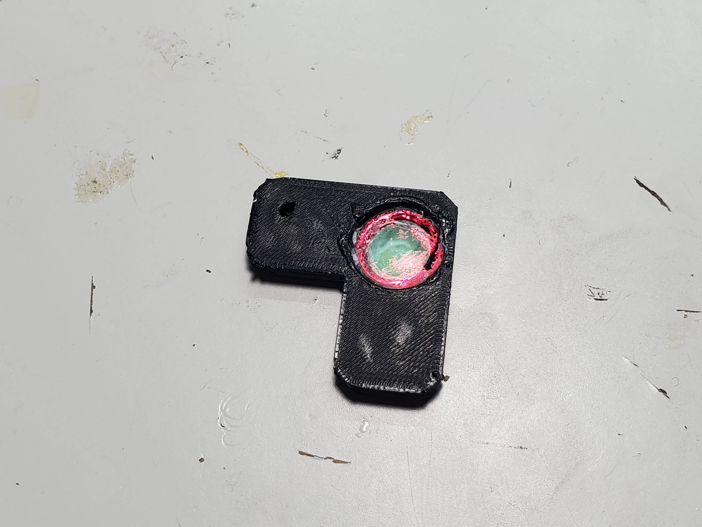
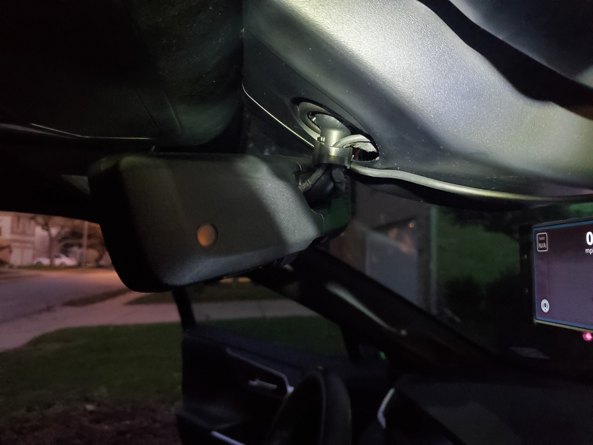
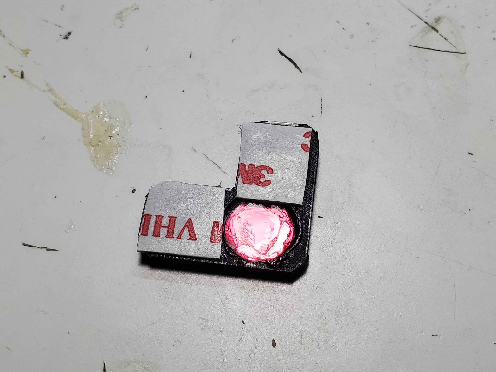
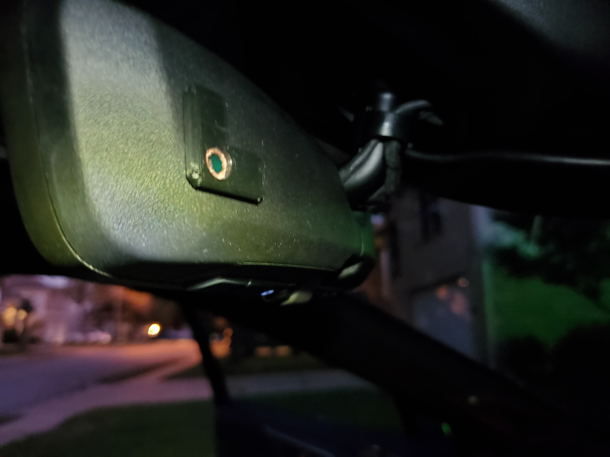

# Comma 2/3 RAV4 IR filter
IR filter mount for the rear view mirror on a gen 5 (2019+) RAV4 for use with the Comma 2/3

# Why?

The Comma device projects IR light to illuminate the driver's face at night.  The IR light is intense enough that it triggers the light level sensor on the digital rearview mirror and it goes into daytime mode.  It's *very* bright.

# What?

This is a little 3D printed mount for an IR filter that you then install over the light sensor on the rearview mirror.

# How?

## IR filter

I ordered one of [these](https://www.amazon.com/gp/product/B07N2Z9NHL).

It is a 10 mm by 1 mm cylindrical IR filter.  These are commonly used for cameras.

Also order some VHB tape if you don't have any.  It's ridiculously useful stuff.

## Printed  mount

Print the STL file in this repo.  I ran mine on a Prusa MK3 with PETG.  ABS would be fine too.  I would avoid PLA since it deforms readily in excessive heat.  Slicer settings aren't critical, but I went with 0.1mm layers.

## Install

### Filter

Install the filter in the printed part like so: 

I glued mine in with CA (super glue).

### Mount to Mirror

Your mirror's sensor is on the passenger side: 

Put some VHB tape on the mount: 

Install over the sensor: 

### That's it! Enjoy your auto-dimming mirror once again!

